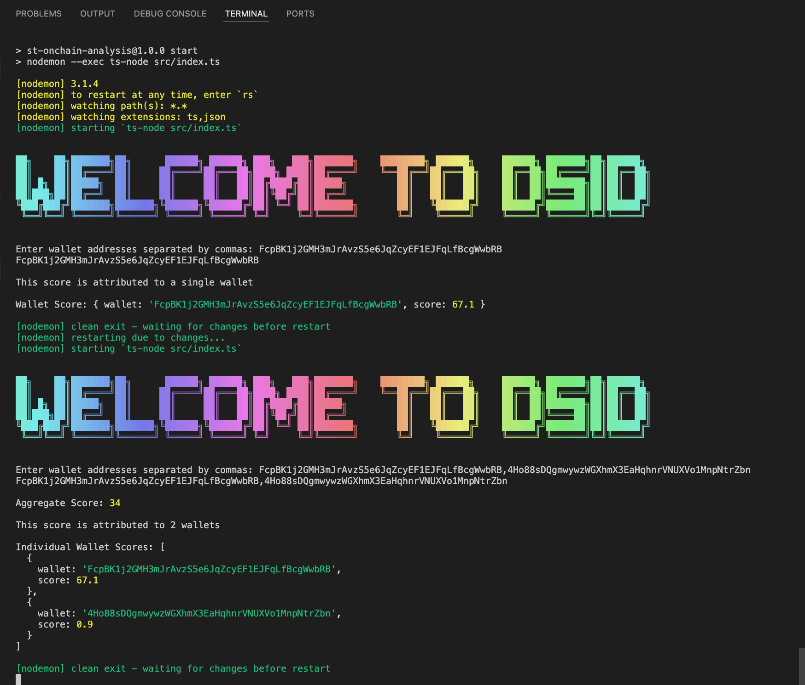

# Solana ID On-Chain Scoring Module

## Introduction

This module analyzes the on-chain footprint of Solana wallet accounts to derive a credibility score.

## Demo

## Setup

1. Clone the repository: `git clone https://github.com/EmekaManuel/Updated-DSID-Analysis`
2. cd `<repository-directory>`
3. Install dependencies: `npm install`
4. Run the project: `npm start`

## Usage

The module calculates the score based on transaction history, token balances, smart contract interactions, and staking activities.

## Dependencies: Utilizes the following dependencies:

1. @solana/web3.js: Library for interacting with the Solana blockchain.
2. typescript: TypeScript language compiler.
3. ts-node & nodemon.
4. readline: Handles user input for wallet addresses.
5. gradient-string: Enhances the visual appeal with ASCII art styling.

## Score Calculation:

1. Single Address: If a single wallet address is entered, the script calculates and displays the score attributed to that wallet.
2. Multiple Addresses: If multiple wallet addresses are entered, it calculates and displays aggregate scores for all provided wallets.
3. Error Handling: Implements robust error handling to manage exceptions and display informative error messages when issues arise during score calculations.

This script enables users to interactively input wallet addresses, retrieve scores, and gain insights into the on-chain activities associated with the provided wallets on the Solana blockchain.

## API Endpoints

- `getTransactionHistory(publicKey: PublicKey)`
- `getTokenBalances(publicKey: PublicKey)`
- `getAccountInfo(publicKey: PublicKey)`
