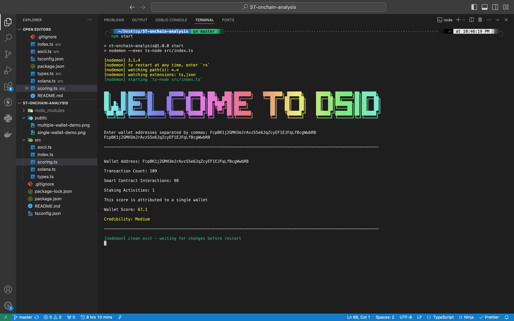

# Solana ID On-Chain Scoring Module

## Introduction

This module analyzes the on-chain footprint of Solana wallet accounts to derive a credibility score.

## Demo

## Setup

1. Clone the repository: `git clone https://github.com/EmekaManuel/Updated-DSID-Analysis`
2. cd `<repository-directory>`
3. Install dependencies: `npm install`
4. Run the project: `npm start`

## Usage

The module calculates the score based on the following criteria:

1. Transaction history
2. Token balances
3. Smart contract interactions
4. Staking activities

## Dependencies: Utilizes the following dependencies:

- `@solana/web3.js`: Library for interacting with the Solana blockchain.
- `typescript`: TypeScript language compiler.
- `ts-node & nodemon`: Tools for TypeScript execution and monitoring.
- `readline`: Handles user input for wallet addresses.
- `gradient-string`: Enhances the visual output with ASCII art styling.

## Score Calculation:

The score for each wallet is calculated using predefined multipliers for each criterion:
Note: These multiplier values can be changed to suit your standard

- `transactionCount`: Weighted at 0.5
- `tokenBalance`: Weighted at 0.3
- `smartContractInteractions`: Weighted at 0.1
- `stakingActivities`: Weighted at 0.1

## Main Features

1. Visually appealing command line interface.
1. Single Address Score Analysis: If a single wallet address is entered, the script calculates and displays the score attributed to that wallet.
1. Multiple Addresses Score Analysis: If multiple wallet addresses are entered, it calculates and displays aggregate scores for all provided wallets. Note that multiple wallet addresses should be separated by a comma when inputing them in the commandline / terminal.
1. Error Handling: Implements robust error handling to manage exceptions and display informative error messages when issues arise during score calculations.

This script enables users to interactively input wallet addresses, retrieve scores, and gain insights into the on-chain activities associated with the provided wallets on the Solana blockchain.

## API Endpoints

- `getTransactionHistory(publicKey: PublicKey)`: Retrieves transaction history for a given wallet.
- `getTokenBalances(publicKey: PublicKey)`: Retrieves token balances associated with a wallet.
- `getAccountInfo(publicKey: PublicKey)`: Retrieves account information, including staking activities.
